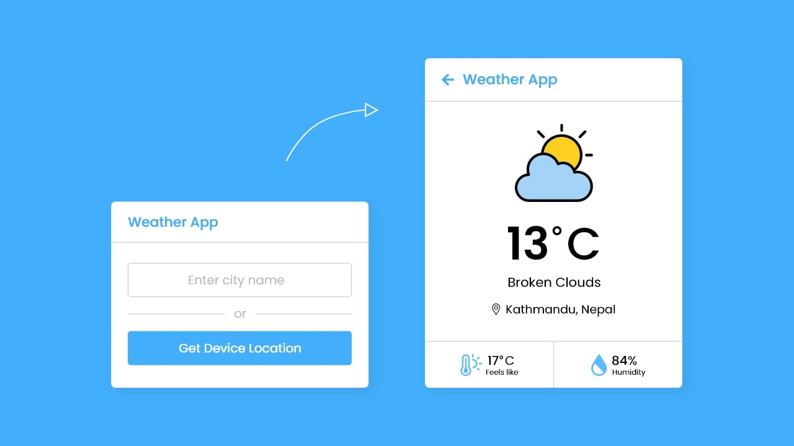

# Weather App in HTML CSS & JavaScript
#### This App was built using [Coding Nepal](https://www.codingnepalweb.com).

In this weather app, you can get the weather details of a particular city by entering the city name or
you can also get your current location weather details by clicking on the “Get Device Location” button.

If you entered an invalid city name then there is shown an error message.
You’ll get many weather details in this app like temperature in celsius,
weather conditions, location, feels like, and humidity. If you’re feeling
difficulty to understand what I’m saying then you can watch a demo video.

https://user-images.githubusercontent.com/34045910/173437446-ac4ba021-c134-45e6-a660-b8c18444b0c4.mp4

I hope you liked this weather app and want to get source codes or files of
it but don’t worry I have provided codes and files to the bottom of this page
and you can copy-paste the codes or download the coding files for free.

Before you go to copy the codes, let’s understand the main codes and concepts of this weather app.
I am ready told you I used vanilla JavaScript to create this weather app. In the JavaScript file,
I got the user entered city name and sent a get request to an OpenWeatherMap API with passing the city name.
If the user clicked on the “Get Device Location” button then first I checked the user browser supports geolocation API or not.
eut’s supported, I got the current latitude and longitude of the device and sent these coordinates to the OpenWeatherMap API.
After I got an object as a response from the API then I displayed the property value to a particular HTML element.
At last, using the id value that API provides us, I showed the custom weather icon/image according to the weather condition.

# Build A Weather App in JavaScript [Source Codes]

Last, create a JavaScript file with the name of script.js and paste the given codes in your JavaScript file. You’ve to create a file with .js extension and remember you have to pass your API key in the API URL otherwise this weather app won’t work and it returns “something went wrong” error. You can get this key from the official OpenWeatherMap site for free.

~~~javascript
This is a line of code in Javascript.

const wrapper = document.querySelector(".wrapper"),
inputPart = document.querySelector(".input-part"),
infoTxt = inputPart.querySelector(".info-txt"),
inputField = inputPart.querySelector("input"),
locationBtn = inputPart.querySelector("button"),
weatherPart = wrapper.querySelector(".weather-part"),
wIcon = weatherPart.querySelector("img"),
arrowBack = wrapper.querySelector("header i");

let api;

inputField.addEventListener("keyup", e =>{
    if(e.key == "Enter" && inputField.value != ""){
        requestApi(inputField.value);
    }
});

locationBtn.addEventListener("click", () =>{
    if(navigator.geolocation){
        navigator.geolocation.getCurrentPosition(onSuccess, onError);
    }else{
        alert("Your browser not support geolocation api");
    }
});

function requestApi(city){
    api = `https://api.openweathermap.org/data/2.5/weather?q=${city}&units=metric&appid=your_api_key`;
    fetchData();
}

function onSuccess(position){
    const {latitude, longitude} = position.coords;
    api = `https://api.openweathermap.org/data/2.5/weather?lat=${latitude}&lon=${longitude}&units=metric&appid=your_api_key`;
    fetchData();
}

function onError(error){
    infoTxt.innerText = error.message;
    infoTxt.classList.add("error");
}

function fetchData(){
    infoTxt.innerText = "Getting weather details...";
    infoTxt.classList.add("pending");
    fetch(api).then(res => res.json()).then(result => weatherDetails(result)).catch(() =>{
        infoTxt.innerText = "Something went wrong";
        infoTxt.classList.replace("pending", "error");
    });
}

function weatherDetails(info){
    if(info.cod == "404"){
        infoTxt.classList.replace("pending", "error");
        infoTxt.innerText = `${inputField.value} isn't a valid city name`;
    }else{
        const city = info.name;
        const country = info.sys.country;
        const {description, id} = info.weather[0];
        const {temp, feels_like, humidity} = info.main;

        if(id == 800){
            wIcon.src = "icons/clear.svg";
        }else if(id >= 200 && id <= 232){
            wIcon.src = "icons/storm.svg";
        }else if(id >= 600 && id <= 622){
            wIcon.src = "icons/snow.svg";
        }else if(id >= 701 && id <= 781){
            wIcon.src = "icons/haze.svg";
        }else if(id >= 801 && id <= 804){
            wIcon.src = "icons/cloud.svg";
        }else if((id >= 500 && id <= 531) || (id >= 300 && id <= 321)){
            wIcon.src = "icons/rain.svg";
        }

        weatherPart.querySelector(".temp .numb").innerText = Math.floor(temp);
        weatherPart.querySelector(".weather").innerText = description;
        weatherPart.querySelector(".location span").innerText = `${city}, ${country}`;
        weatherPart.querySelector(".temp .numb-2").innerText = Math.floor(feels_like);
        weatherPart.querySelector(".humidity span").innerText = `${humidity}%`;
        infoTxt.classList.remove("pending", "error");
        infoTxt.innerText = "";
        inputField.value = "";
        wrapper.classList.add("active");
    }
}

arrowBack.addEventListener("click", ()=>{
    wrapper.classList.remove("active");
});
~~~

Second, create a CSS file with the name of style.css and paste the given codes in your CSS file. Remember, you’ve to create a file with .css extension.

~~~css
This is a line of code in CSS.

@import url('https://fonts.googleapis.com/css2?family=Poppins:wght@400;500;600;700&display=swap');
*{
  margin: 0;
  padding: 0;
  box-sizing: border-box;
  font-family: 'Poppins', sans-serif;
}
body{
  display: flex;
  align-items: center;
  justify-content: center;
  min-height: 100vh;
  background: #43AFFC;
}
::selection{
  color: #fff;
  background: #43AFFC;
}
.wrapper{
  width: 400px;
  background: #fff;
  border-radius: 7px;
  box-shadow: 7px 7px 20px rgba(0, 0, 0, 0.05);
}
.wrapper header{
  display: flex;
  font-size: 21px;
  font-weight: 500;
  color: #43AFFC;
  padding: 16px 15px;
  align-items: center;
  border-bottom: 1px solid #ccc;
}
header i{
  font-size: 0em;
  cursor: pointer;
  margin-right: 8px;
}
.wrapper.active header i{
  margin-left: 5px;
  font-size: 30px;
}
.wrapper .input-part{
  margin: 20px 25px 30px;
}
.wrapper.active .input-part{
  display: none;
}
.input-part .info-txt{
  display: none;
  font-size: 17px;
  text-align: center;
  padding: 12px 10px;
  border-radius: 7px;
  margin-bottom: 15px;
}
.input-part .info-txt.error{
  color: #721c24;
  display: block;
  background: #f8d7da;
  border: 1px solid #f5c6cb;
}
.input-part .info-txt.pending{
  color: #0c5460;
  display: block;
  background: #d1ecf1;
  border: 1px solid #bee5eb;
}
.input-part :where(input, button){
  width: 100%;
  height: 55px;
  border: none;
  outline: none;
  font-size: 18px;
  border-radius: 7px;
}
.input-part input{
  text-align: center;
  padding: 0 15px;
  border: 1px solid #ccc;
}
.input-part input:is(:focus, :valid){
  border: 2px solid #43AFFC;
}
.input-part input::placeholder{
  color: #bfbfbf;
}
.input-part .separator{
  height: 1px;
  width: 100%;
  margin: 25px 0;
  background: #ccc;
  position: relative;
  display: flex;
  align-items: center;
  justify-content: center;
}
.separator::before{
  content: "or";
  color: #b3b3b3;
  font-size: 19px;
  padding: 0 15px;
  background: #fff;
}
.input-part button{
  color: #fff;
  cursor: pointer;
  background: #43AFFC;
  transition: 0.3s ease;
}
.input-part button:hover{
  background: #1d9ffc;
}

.wrapper .weather-part{
  display: none;
  margin: 30px 0 0;
  align-items: center;
  justify-content: center;
  flex-direction: column;
}
.wrapper.active .weather-part{
  display: flex;
}
.weather-part img{
  max-width: 125px;
}
.weather-part .temp{
  display: flex;
  font-weight: 500;
  font-size: 72px;
}
.weather-part .temp .numb{
  font-weight: 600;
}
.weather-part .temp .deg{
  font-size: 40px;
  display: block;
  margin: 10px 5px 0 0;
}
.weather-part .weather{
  font-size: 21px;
  text-align: center;
  margin: -5px 20px 15px;
}
.weather-part .location{
  display: flex;
  font-size: 19px;
  padding: 0 20px;
  text-align: center;
  margin-bottom: 30px;
  align-items: flex-start;
}
.location i{
  font-size: 22px;
  margin: 4px 5px 0 0;
}
.weather-part .bottom-details{
  display: flex;
  width: 100%;
  justify-content: space-between;
  border-top: 1px solid #ccc;
}
.bottom-details .column{
  display: flex;
  width: 100%;
  padding: 15px 0;
  align-items: center;
  justify-content: center;
}
.column i{
  color: #5DBBFF;
  font-size: 40px;
}
.column.humidity{
  border-left: 1px solid #ccc;
}
.column .details{
  margin-left: 3px;
}
.details .temp, .humidity span{
  font-size: 18px;
  font-weight: 500;
  margin-top: -3px;
}
.details .temp .deg{
  margin: 0;
  font-size: 17px;
  padding: 0 2px 0 1px;
}
.column .details p{
  font-size: 14px;
  margin-top: -6px;
}
.humidity i{
  font-size: 37px;
}
~~~

First, create an HTML file with the name of index.html and paste the given codes in your HTML file. You’ve to create a file with .html extension and remember the images that are used on this weather app will not appear. So download the source files to use images also.

~~~html
This is a line of code in HTML.

<!DOCTYPE html>
<!-- Coding By CodingNepal - youtube.com/codingnepal -->
<html lang="en" dir="ltr">
  <head>
    <meta charset="utf-8">
    <title>Weather App in JavaScript | CodingNepal</title>
    <link rel="stylesheet" href="style.css">
    <meta name="viewport" content="width=device-width, initial-scale=1.0">
    <!-- Linking BoxIcon for Icon -->
    <link href='https://unpkg.com/boxicons@2.0.9/css/boxicons.min.css' rel='stylesheet'>
  </head>
  <body>
    

      <header><i class='bx bx-left-arrow-alt'></i>Weather App</header>
      <section class="input-part">
        

        

          <input type="text" spellcheck="false" placeholder="Enter city name" required>
          

          <button>Get Device Location</button>
        

      </section>
      <section class="weather-part">
        
        

          _
          °C
        

        
_ _

        

          <i class='bx bx-map'></i>
          _, _
        

        

          

            <i class='bx bxs-thermometer'></i>
            

              

                _
                °C
              

              
Feels like

            

          

          

            <i class='bx bxs-droplet-half'></i>
            

              _
              
Humidity

            

          

        

      </section>
    

    

  </body>
</html>
~~~
